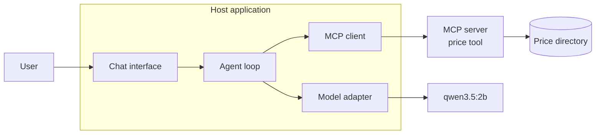
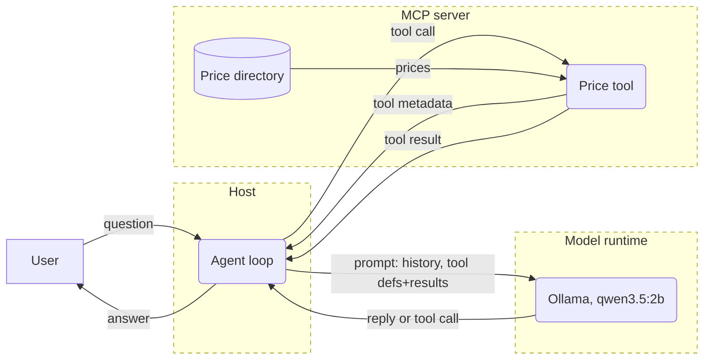

---
# ============================================================================
# EXAMPLE POST — delete before merging to main, or keep as a reference.
#
# To publish a new article:
#   1. Copy this file into _posts/ named  YYYY-MM-DD-your-slug.md
#      The date controls ordering; the slug becomes /writing/your-slug/
#   2. Fill in title and standfirst below. Both appear on the article cards
#      on the homepage (latest three) and the /writing/ index — nothing else
#      to update anywhere.
#   3. Write the body in Markdown. Push. GitHub Pages builds and publishes.
#
# The layout (article) is applied automatically by _config.yml.
# ============================================================================
title: "Part 1: Threat Modelling AI Systems"
standfirst: "Investigating threat modelling approaches for systems that use LLM technology"
---

## Context

Threat modelling is a technique for looking at the architecture of a system or part of a system or feature through a security lens. Asking the question of what could go wrong that might have security implications, so that mitigations can be considered.

Typically this looks like drawing out the components of a system at an appropriate level of detail, before adding boundaries where data moves from one level of trust to another. The boundaries then give something concrete to focus on when thinking about threats.

STRIDE is perhaps the best known method of thinking about the failure cases and what could go wrong. Can someone **s**poof an identity, **t**amper with data, **r**epudiate doing something, access **i**nformation they shouldn't, **d**eny legitimate access to the system, or **e**levate to privileges they weren't given? The exercise is intended to result in a list of architectural considerations and controls, and it's typically cheaper to act on that list at the design stage rather than after development.

While the principles remain sound, putting an LLM in the middle of a system does change how architectures need to be thought about when threat modelling compared to more "traditional" CRUD systems. The introduction of natural language processing at potentially both input and output stages, and the non-deterministic nature of the technology, mean that instructions and data can't easily be separated. Data flows end up becoming control flows, or to put it another way, the line between data and process instruction becomes blurred. 

Threat modelling and product security references are evolving to account for the new challenges. OWASP publishes a Top 10 for LLM Applications, and has also added a separate [Top 10 for Agentic Applications](https://genai.owasp.org/resource/owasp-top-10-for-agentic-applications-for-2026/) to cover models that call tools.

[MITRE ATLAS](https://atlas.mitre.org/) takes the well established ATT&CK approach and applies it to AI systems. There's also [STRIDE-AI](https://github.com/LaraMauri/STRIDE-AI) which looks at STRIDE and how it can be applied to machine learning assets, though tends to concentrate more on training data.

Reading the theory is all well and good, but some things are just better learned in practice and through experience. This small proof of concept uses Model Context Protocol (MCP), a standard for AI applications to connect to external tools and data.

## Building a basic MCP proof of concept

[Available on Github](https://github.com/alibaabaa/mcp-mvp)

The basic application is intentionally kept simple, with very few moving parts. The focus of the lab is to look at a practical example of threat modelling an MCP system.

The sample application is a basic text prompt that enables the user to get the price of a fruit by asking the question using natural language. Someone types "how much for a banana?" and the app uses an MCP connection to an external data source to retrieve the relevant data and respond to the conversation.

This is simple enough to be quick and easy to build, but gives enough attack surface to make for an interesting initial proof of concept. The model should always provide the price from the look up tool, maintaining data integrity. It is intended as a simplified version of a common pattern in real systems, where a language model sits in front of data that it shouldn't make changes to before presenting to the user, like stock levels or account balances.

The proof of concept is written in Python and has three parts.

- The MCP server holds the "price directory" and exposes an MCP tool to retrieve a price for a given fruit. In MCP, the server doesn't need to know anything about language models. It's just another function that has an input and output type. In this case, `string` ("banana") in, `float` (0.35) out.
- There's a host that provides the interface to the user. It connects to the MCP server, gets the server's available tools, and coordinates the messages between user, LLM, and server.
- Inside the host sits the agent loop. It sends the user's question and list of tools to the model, runs any tool calls from the model, and returns the result back to it.

The model itself can't decide the price, and it can't call on the lookup directory tool either. The host application mediates between the model and the available tools, and it's this mediation layer that acts as the agent loop.

The LLM in this sample app is Qwen 3.5 at 2 billion parameters (`qwen3.5:2b`), running locally. It's small enough to run on a laptop, and trained for calling tools. 

Running it locally means that everything stays on the own machine, avoiding any risk of breaching any frontier model terms during experimentation.

## How the pieces connect



In MCP, the model and the MCP server never communicate directly. When the host starts, it asks the server for its tools and gets back names, descriptions and JSON schemas.

The model adapter converts those into the model provider's (Ollama in this case) API format, so the model receives a list of tools in its expected format, and the server only sees structured programmatic calls from the host. Changing the LLM would mean rewriting only the adapter, which helps avoid technology lock-in.

## Trust boundaries

With the basic shape of the application in place, we can create a new DFD with some trust boundaries included.



This diagram now has three boundaries:

- User to host.
- Host to model runtime.
- Host to MCP server.

The model runtime boundary is where the nuance of modelling AI integrated systems lives. If it were a typical external API, then the data transiting the boundary could be validated and processed as data accordingly. But when that external system is an LLM, the line between data and instruction is blurred.

What's more, typical validation and sanitisation methods that might otherwise be relied upon probably won't work. Anything that crosses into the model's context can change its behaviour, and in ways that can't easily be verified.

When treating the MCP server as an external source, and the model being probabilistic regardless of who operates it, the host as the negotiator becomes the only place where we have trusted control and therefore the de facto policy enforcement point.

## Getting a price for a banana

When building the MCP server, the Python SDK turns a decorated function into a tool, and the function's docstring becomes the description the model reads:

```python
@mcp.tool()
def price_lookup(product: str) -> float:
    """Looks up the price of any fruit."""
```

Already this is a point of trust to consider, because the docstring here doesn't just provide the function documentation for a developer, but becomes text that flows into the AI model context. So it's now prompt input, and the author of the tool gets to put text directly into the model's context. It's worth noting that MCP also provides the concept of tool annotations, which can be used to provide additional metadata to a model, such as whether the tool supports destructive actions.

A successful run takes two calls to the model and one to the tool:

```
fruit> How much is a banana?
  [thinking] The user is asking about the price of a banana. I need to use the price_lookup tool to find out the price of bananas.
  [host] model requested price_lookup({'product': 'banana'}); calling MCP server
  [thinking] The price lookup returned 0.25, which is likely in some currency unit (probably dollars). I should provide a brief answer to the user about this price.
A banana costs $0.25.
```

*Note that **reasoning** is turned on in these examples mainly to help support the write up.*

The model gets the question plus the tool definitions. It uses reasoning on these inputs to reply with a structured request to call the price tool. The host makes the call over MCP and returns the result to the model. On the second call the model writes a reply to the user.

The model is smart enough to establish from the tool definition and user input that it should be looking up the price. Its job is to pick the tool with the right argument and then phrase whatever comes back.

There's also a warning sign here though. The tool doesn't provide a currency for the price, and so the model opaquely decides that dollars is a reasonable guess, and returns this as part of the answer. This gives a first glimpse of what might be yet to come. This is a UK application, and the prices coming back from the tool should be treated as GBP (£). With nothing to indicate this, the model is making a best guess, and so on its first run, without any attempt to attack it, it has already given away a banana for less that it should have.

Let's fix this naively for now by changing the MCP tool description to say that prices are in GBP:

```python
@mcp.tool()
def price_lookup(product: str) -> float:
    """Looks up the price of any fruit in GBP."""
```

## Next: stealing a banana

The MVP works, but as already demonstrated, loose implementations quickly surface poor design and missing boundary controls. As the series progresses, we will examine this specific failure, along with other flows that cross a trust boundary and vulnerabilities that need to be considered.

## Sources

- [OWASP GenAI LLM Top 10 2026](https://genai.owasp.org/resource/owasp-genai-llm-top-10-2026/)
- [OWASP Top 10 for Agentic Applications 2026](https://genai.owasp.org/resource/owasp-top-10-for-agentic-applications-for-2026/)
- [MITRE ATLAS](https://atlas.mitre.org/)
- [STRIDE-AI (Mauri and Damiani)](https://github.com/LaraMauri/STRIDE-AI)
- [Model Context Protocol](https://modelcontextprotocol.io/)