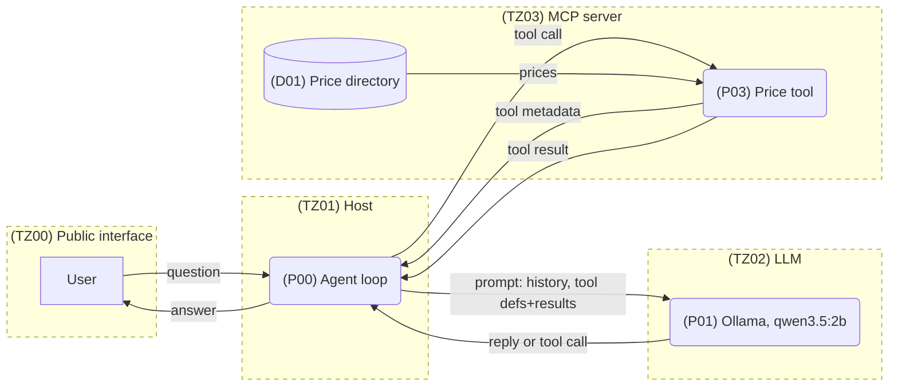

In [Part 1](/writing/threat-modelling-ai-systems-1/) we introduced a minimal chatbot-style application that allows a user to ask for the price of a fruit in natural language, and through integration of an LLM with a price directory, they receive a natural language response with the price.

## What are we working on?

We then produced a level 0 DFD to represent this system. Here we label the components so that we can begin thinking about specific parts of the system, their trust boundaries, and how they interact.

The trust boundary between **TZ00** and **TZ01** covers the flow of untrusted public input to the application from the user and is a familiar point of attack in applications, because it's the point where we have no control over the input data.

But in an application that integrates an LLM, we can observe something different in the trust boundary between **TZ01** and **TZ02** to what might be seen in a more traditional system. Here, we have two components that we select and own:

- the host (**TZ01**)
- the large language model (**TZ02**).

But unlike a traditional system, we must consider the output of one of the internal system components **TZ02** to be untrusted.

At first this decision looks analogous how we would treat a datastore that stores sanitised user input: it's part of our system but we don't fully trust the output. But the important difference is that we have deterministic control over a datastore. In a datastore, if a certain level of sanitisation has been in place from the start, then while we might not trust the data in an execution context, we can still make some level of assertion about its safety. But in the case of an LLM, there are no deterministic controls. The inputs to an LLM result in unpredictable outputs. For this reason, **TZ02** must be considered untrusted.

The trust boundary between **TZ01** and **TZ03** covers the retrieval of pricing data from a data store and server that we control. For the purposes of this exercise, we will treat this as a traditional data layer, the MCP server being developed in house or at least within our control and known safe. If using a third party MCP server, we would need another trust boundary between the pricing tool (**P03**) and our price directory (**D01**).

## What could go wrong?

There are different approaches to establishing and categorising threats to a system. When working on a system with a team, consistency and having an established process is more important than the specifics of how that process runs. An established process allows different individuals to run a threat modelling exercise and reach the same conclusions. It also allows for comparisons of a system over time, to track trends and assess impacts of changes.

We identified **STRIDE** in part one as a well known framework often used for enumerating threats. Systems that integrate LLMs present threat enumeration challenges when using STRIDE because there are some novel categories that don't map well onto the STRIDE structure, but there is broad agreement that many of the threats from LLMs can be categorised. We can map those out something like this:

| Category               | OWASP LLM Top 10                       | LLM-specific example                                         |
| ---------------------- | -------------------------------------- | ------------------------------------------------------------ |
| Spoofing               | LLM01 Prompt injection                 | Malicious or "jailbreak" prompt masquerading as part of a system prompt, effectively spoofing the instruction origin. |
| Tampering              | LLM05 Data and model poisoning         | Poorly managed supply chain resulting in use of an adversarial model. |
| Repudiation            | LLM03 Excessive agency                 | Model behaviour is insufficiently audited, and the model provides an unreliable account of its own activity. |
| Information disclosure | LLM02 Sensitive information disclosure | Connection to a knowledgebase overshares with a model, causing sensitive data to leak into RAG. |
| Denial of service      | LLM06 Unbounded consumption            | Specially crafted prompt that appears harmless causes a model to fall into an endless reasoning loop, consuming unbounded resources. |
| Elevation of privilege | LLM03 Excessive agency                 | Tool connection does not sufficiently restrict permitted operations, allowing model to perform unnecessary operations. |

While this isn't by any means a comprehensive listing, it illustrates that many of the traditional STRIDE categories still apply. There are ways to map new generative AI threats onto STRIDE.

What it doesn't do is produce a complete enumeration of the new and complex threat categories that large language models introduce. Once any one individual component in a system is coordinating access to external APIs, looking up internal data and making autonomous and unpredictable decisions, it's doing more with more agency than anything STRIDE was originally intended for.

There are different emerging approaches to filling that gap that are beyond the scope of this discussion. MAESTRO is one example of a threat modelling framework with methodology built specifically to address agentic AI.

## Identifying vulnerabilities

Let's look at a table of vulnerabilities that might emerge for the pricing look up application built in part one when we apply the question of what could go wrong.

| Vuln ID | Description                                                  |
| ------- | ------------------------------------------------------------ |
| V01     | A malicious prompt could convince the application into offering fruit for less than its listed price. |
| V02     | An insufficiently aligned model might not use the available pricing lookup MCP tool and either invent or deny access to the price. |
| V03     | A misconfigured MCP tool might overshare, causing a sensitive data leak from the pricing directory. |
| V04     | Insufficient agent management could result in a confused model entering an endless loop and consuming all resources. |

In a real world, less contrived threat modelling exercise, we would build out this vulnerability list further, focusing on refining the scope and search space of the exercise to identify the most relevant risks.

Attempting to create an exhaustive list of every possible combination of threat agent and attack type is often counterproductive. Trying to do so becomes an exercise in futility, consumes large amounts of time and resource and produces output that is almost impossible to triage and act upon.

MITRE ATT&CK and, for AI-based threats specifically, MITRE ATLAS, are excellent resources for looking at threats from the outside in, and provides a useful perspective and context when making decisions about what to include in real world threat modelling.

## Next: what are we going to do about it?

The application is intentionally kept simple, but applying the question of what could go wrong has already identified a number of vulnerabilities, most of which relate to the untrusted output of the model. In the next part of the series, we will look at the controls that can be put in place to mitigate these vulnerabilities, along with where they should be enforced in the system.
